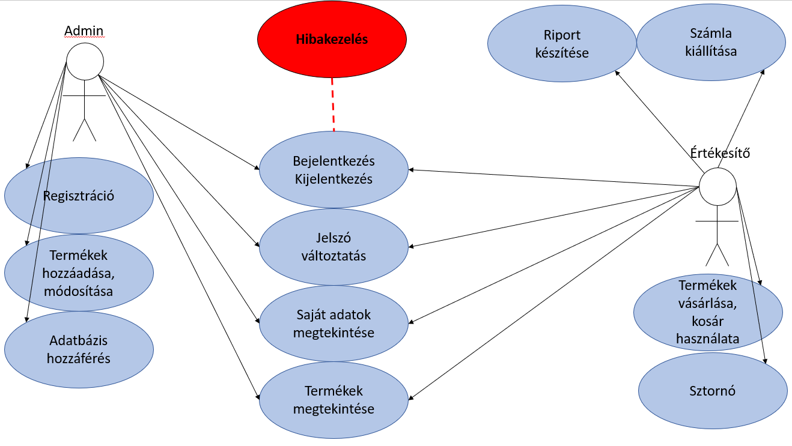
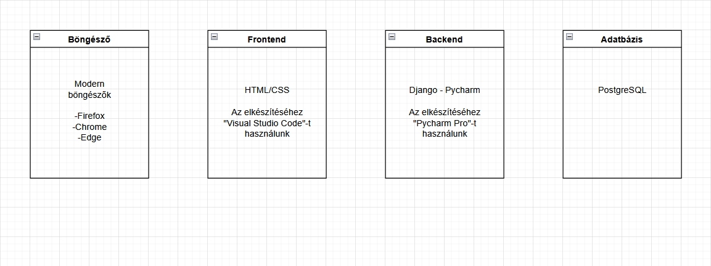
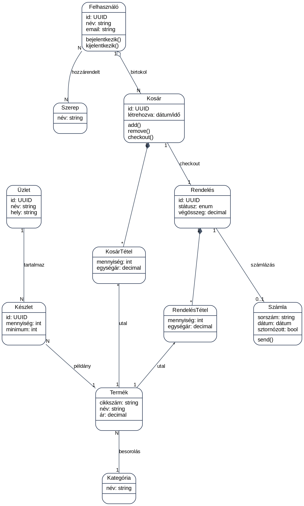
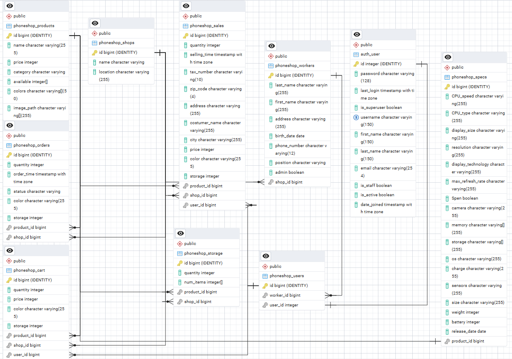

# Phoneshop Rendszerterv

### A rendszer célja

A rendszer célja, hogy az értékesítők számára egy modern, 
könnyen kezelhető és átlátható webes felületet biztosítson a termékek kezeléséhez és értékesítéséhez.
A felületnek lehetőséget nyújt a készletek nyomon követésére, a termékek keresésére és szűrésére, valamint a számlák kezelésére.
Fontos szempont, hogy az alaklamazás felhasználóbarát legyen, 
így a különböző technikai tudással rendelkező felhasználók is könnyen eligazodhatnak rajta.

A partnercégek számára biztosított felületen az értékesítők gyorsan elérhetik a hozzájuk tartozó üzletek készleteit,
és szükség esetén bővíthetik azokat egy virtuális raktárból.
Riportkészítési funkciót biztosít, amely lehetővé teszi a napi, heti és havi (utóbbi kettő autómatikusan, megadott rendszeresség alapján) 
értékesítési adatok megjelenítését Excel formátumban, így segítve az értékesítő munkáját, és a vállalat üzleti folyamatainak módosítását.

A több termék iránt érdeklődő vásárlók kielégítésének kulcsa a korsár funkció.
Az értékesítő munkatárs így egyszerre több termék árusítását tudja elvégezni.

A rendszer elsődleges célja, hogy csökkentse az értékesítési folyamatok időigényét,
egyszerűsítse a munkatársak mindennapi tevékenységeit,
valamint pontos és naprakész információkat biztosítson a készletekről és az értékesítésekről.

### Projektterv

**Csapattagok és közös felelősség körök**

A négy fejlesztő egységes csapatként dolgozik, így mindenki részt vesz a backend, 
frontend, tesztelés és dokumentáció feladataiban is.

A munka megosztás dinamikusan, az aktuális projektigények szerint történik.

**Fő feladatkörök:**

- **Backend fejlesztés:** adatbázis, API-k, üzleti logika megvalósítása.
- **Frontend fejlesztés:** reszponzív Angular alapú felhasználói felület kialakítása.
- **Tesztelés:** egység- és funkcionális tesztek készítése, hibajavítás.
- **Dokumentáció:** követelmény- és rendszerterv, tesztterv, végső projektleírás elkészítése.

| Funkció / Story            | Feladat / Task                            | Prioritás | Becslés | Aktuális becslés | Eltelt idő | Hátralévő idő |
|----------------------------|-------------------------------------------|-----------|---------|------------------|------------|---------------|
| Követelményspecifikáció    | Dokumentum elkészítése                    | 0         | 10      | 10               | 10         | 0             |
| Funkcionális specifikáció  | Funkciók és folyamatok leírása            | 0         | 10      | 10               | 10         | 0             |
| Rendszerterv               | Architektúra és adatmodell kidolgozása    | 0         | 14      | 14               | 8          | 6             |
| Adatmodell                 | Adatbázis struktúra megtervezése          | 1         | 6       | 6                | 4          | 2             |
| Backend alapfunkciók       | API fejlesztés és üzleti logika           | 2         | 12      | 12               | 2          | 10            |
| Frontend alapok            | HTML/CSS, UI tervezés                     | 2         | 10      | 10               | 3          | 7             |
| Login funkció              | Bejelentkezés és jogosultságkezelés       | 2         | 8       | 8                | 0          | 8             |
| Termékkezelés              | Termékek megjelenítése, keresés, szűrés   | 2         | 10      | 10               | 0          | 10            |
| Kosár funkció              | Kosár logika és UI implementálása         | 2         | 10      | 10               | 0          | 10            |
| Riport funkció             | Napi/heti/havi riport készítése           | 1         | 8       | 8                | 0          | 8             |
| Tesztelés                  | Unit és funkcionális tesztek végrehajtása | 1         | 10      | 10               | 0          | 10            |

*Az Becslés/Aktuális becslés/Eltelt idő/Hátralévő idő oszlopok órában értendőek*

### Üzleti folyamatok modellje

*Üzleti modell*

# Követelmények

- Leírja nagyvonalakban, miket kell teljesítenie a programnak.  
- **Példa: Funkcionális követelmények:**

## Funkcionális követelmények

- Felhasználók regisztrációja és bejelentkezése email-cím és jelszó alapján.  
- Jogosultsági szintek kezelése (admin, értékesítő, partner).  
- Termékek listájának megjelenítése valós idejű készletadatokkal.  
- Készletfigyelés és automatikus riasztás alacsony készletszint esetén.  
- Termékek keresése név, ár, típus alapján.  
- Találatok szűrése kategóriák és árkategóriák szerint.  
- Kosár funkció: termékek hozzáadása, eltávolítása, végösszeg számítása.  
- Vásárlási folyamat támogatása számla előnézettel és kiállítással.  
- Számla sztornózása hibás tranzakció esetén.  
- Napi riport manuális indítása az eladásokról.  
- Heti és havi riportok automatikus generálása Excel formátumban.  
- Adminisztrátor által kezelt készletkezelés és felhasználó-hozzárendelés.  
- Partnercégek regisztrációja és jogosultsági kiosztása.  
- Rendszer naplózza a felhasználói és adminisztratív műveleteket.  

## Nem funkcionális követelmények

- A felhasználói felület legyen reszponzív és könnyen áttekinthető.  
- Nagy terhelés alatt is biztosítson stabil működést.  
- Keresési és szűrési műveletek maximum 2 másodpercen belül válaszoljanak.  .  
- A felület webes környezetben hibátlanul működjön.  
- A riportok letöltése szabványos formátumban (Excel) történjen.  
- Felhasználók nem férhetnek hozzá más felhasználók személyes adataihoz.  
- Adatbázis-tárolás titkosítással történjen.  
- Jelszavak biztonságos, egyirányúan kódolt formában legyenek tárolva.  
- Naplózott adatokhoz kizárólag adminisztrátor férhet hozzá.  

## Törvényi előírások, szabványok

- GDPR előírásoknak való megfelelés.  
- Adatbiztonsági szabványok (ISO/IEC 27001) követése.  
- Szoftverminőségi szabványok (ISO/IEC 25010) figyelembevétele.  
- Naplózás és adathozzáférés nyomonkövethetősége. 

# Funkcionális terv

## Rendszerszereplők:
- Adminisztrátor  
- Értékesítő  
- Partnercég  
- Vásárló  

## Rendszerhasználati esetek és lefutásaik:

### ADMINISZTRÁTOR:
- Teljes körű hozzáférése van a rendszerhez.    
- Jogosultsági szintek kezelése (admin, értékesítő, partner).  
- Termékek és készlet manuális bővítése, frissítése.  
- Partnercégek regisztrálása és készlet-hozzárendelés.  
- Számlák sztornózása és javítása.  
- Rendszernaplók és riportok ellenőrzése.  

### ÉRTÉKESÍTŐ:
- Bejelentkezés a rendszerbe email-címmel és jelszóval.  
- Termékek listázása és készletadatok megtekintése.  
- Termékek keresése és szűrése különféle paraméterek alapján.  
- Termékek kosárba helyezése, mennyiség módosítása, eltávolítás.  
- Vásárlás lebonyolítása és számla kiállítása.  
- Hibás számlák sztornózása.  
- Napi riport manuális indítása és letöltése.  

### PARTNERCÉG:
- Saját hozzáférés kezelése.  
- Hozzárendelt készletek megtekintése.  
- Termékek státuszának követése.  

### VÁSÁRLÓ:
- Termékek megtekintése és leírásaik olvasása.  
- Kosárba helyezés az értékesítő közreműködésével.  
- Vásárlás jóváhagyása és visszaigazolás fogadása.  

## Menü-hierarchiák:

- **BEJELENTKEZÉS**  
  - Bejelentkezés  
  - Regisztráció  
  - Segítség (Help)  

- **FŐMENÜ (Értékesítő számára)**  
  - Terméklista  
  - Keresés és szűrés  
  - Kosár megtekintése  
  - Vásárlás / számla kiállítás  
  - Riportok (Napi / Heti / Havi)  
  - Kijelentkezés  

- **ADMIN MENÜ**  
  - Felhasználókezelés  
  - Termék- és készletkezelés  
  - Partnercégek kezelése  
  - Számlák kezelése  
  - Rendszernaplók és biztonsági beállítások  

### Fizikai környezet

Az alkalmazás webes platformra készül, reszponzív kialakítással, így asztali számítógépeken és laptopokon is használható.
A rendszer nem igényel telepítést a felhasználó eszközére, mivel modern böngészőből érhető el (Chrome, Firefox, Edge, Safari).

A szerveroldali környezet a tervek szerint helyi (lokális) szerveren kerül kialakításra,
mivel ennek üzemeltetése jelentősen alacsonyabb költséggel jár,
így partnereink számára gazdaságosabb megoldást biztosít a rendszer hosszú távú fenntartására.

A rendszer teljes mértékben open source komponensekre épül, nem használ megvásárolt, zárt forráskódú szoftvert.

**Fejlesztésre használt eszközök:**

- Pycharm Professional - backend fejlesztése (Python Django keretrendszere)
- Visual Studio Code - fronted fejlesztése (HTML/CSS)
- Figma - felhasználói felület tervezése, képernyő tervezés
- Git és Github - verziókezelés és csapatmunka támogatása

*Fejlesztésre használt eszközök*

### Architekturális terv - Marci
- A webáruház architektúrája három fő rétegre tagolódik: prezentációs réteg (frontend), alkalmazásréteg (backend), 
és adatkezelési réteg (adatbázis). A cél egy jól strukturált, biztonságos és könnyen bővíthető rendszer, 
amely támogatja a termékek megjelenítését, kosárkezelést, rendelésfeldolgozást és felhasználói autentikációt.

- A frontend a Django sablonrendszerére épül, HTML, CSS és JavaScript segítségével jeleníti meg az oldalakat. 
A JavaScript felelős az interaktív elemekért, 
például a kosár dinamikus frissítéséért vagy az AJAX-alapú kommunikációért a backend felé.

- Az alkalmazásréteg Django keretrendszert használ, amely MVC mintát követ. 
A modellek definiálják az adatstruktúrákat, a view-k kezelik az üzleti logikát, 
míg a template-ek a megjelenítést biztosítják. A Django REST Framework lehetőséget ad API-k kialakítására, 
így a frontend akár SPA-ként is működhet, vagy külső rendszerek is integrálhatók.

- Az adatkezelési réteg MySQL adatbázist használ, amelyet a Django ORM kezel. 
Az adatbázis tárolja a felhasználók, termékek, rendelések, kosártételek és adminisztrációs adatok struktúráját. 
A rendszer támogatja a relációs kapcsolatokat, például egy rendelés több terméket is tartalmazhat, 
és egy felhasználó több rendelést is leadhat.

- A rendszer moduljai közé tartozik a termékkezelés, kosárkezelés, rendelésfeldolgozás, 
felhasználói regisztráció és bejelentkezés, valamint az adminisztrációs felület. 
A jogosultságkezelés Django beépített auth rendszerével történik, amely kiegészíthető JWT vagy session alapú autentikációval.

  
- A rendszer Dockerrel konténerizálható, így a fejlesztési és éles környezetek egységesíthetők. 
CI/CD pipeline bevezetésével automatizálható a tesztelés és a telepítés. 
A teszteléshez Django beépített tesztkeretrendszere, valamint Pytest is használható.

### Adatbázis terv

*Adatbázis terv*

### Implementációs terv

A tervezett webes felület fejlesztése során a fő cél egy olyan modern, biztonságos és jól skálázható rendszer létrehozása, amely egyszerre képes kiszolgálni a felhasználói igényeket és a menedzsment szempontokat is. A frontend elsősorban HTML, CSS és JavaScript nyelveken készül, a kódok elkülönítve kerülnek kezelésre: a HTML biztosítja az oldalak szerkezetét és tartalmi elemeit, a CSS a megjelenést és reszponzív elrendezést szabályozza, míg a JavaScript az interaktív funkciókért, eseménykezelésekért és dinamikus tartalmak betöltéséért felel. A kód külön fájlokba szervezése elősegíti az átláthatóságot, a karbantarthatóságot, valamint a jövőbeli bővítések egyszerű végrehajtását.

A frontend és a backend közötti kommunikáció REST API-n keresztül valósul meg, amely teljes körű CRUD (Create, Read, Update, Delete) műveleteket biztosít az adatbázis kezelésére. Ez azt jelenti, hogy minden adat – legyen szó termékekről, felhasználókról vagy rendelések adatairól – biztonságosan és pontosan módosítható, lekérdezhető és törölhető. A felhasználói élmény egyik kulcseleme, hogy a látogatók könnyedén böngészhessenek a termékek között, a kiválasztott termékeket kosárba tehessék, majd a rendelési folyamaton keresztül egyszerűen leadhassák a megrendeléseiket. A kosár kezelése a kliens oldalon is történik, vagyis a felhasználó azonnal láthatja a mennyiségek változását, a kosár teljes árát, valamint a hozzáadott vagy eltávolított termékek listáját, ami jelentősen növeli a felhasználói élményt.

A rendelési folyamat során a rendszer valós idejű ellenőrzéseket hajt végre. Például ellenőrzi, hogy a kiválasztott termékek raktárkészlete rendelkezésre áll-e, illetve hogy a felhasználó megfelelő jogosultsággal rendelkezik-e a tranzakció végrehajtásához. A raktárkészlet változása nyomon követhető lesz a főoldalon, ahol ha nagyon kevés termék áll rendelkezésre, akkor jelzést ad a felhasználónak, hogy rendelnie kell. Ez egy fiktív központi raktárból megoldhatóvá válik. Valójában leadja a rendelést és egy előre beállított időn belül növekszik az üzlet raktárkészlete, ezzel együtt a státusza is megváltozik a rendelésnek. Ezekről visszaigazoló üzenet is érkezik, hogy egy adott termék kosárba tétele sikeres, vagy nem. Nem csak szöveges formában, hanem színekkel is segítjük a felhasználói élményt, így egyszerűen fel lehet ismerni, ha hiba keletkezik. A bejelentkezés és regisztráció folyamata biztonságos jelszókezeléssel van megoldva: a jelszavak nem nyers formában kerülnek tárolásra, hanem korszerű titkosítási algoritmusokkal hash-elve. Ez biztosítja, hogy az esetleges adatvédelmi incidensek során a felhasználói adatok ne legyenek közvetlenül hozzáférhetők.

A backend réteg Django keretrendszerre épül, amely biztosítja az adatbázis-műveletek pontos és biztonságos végrehajtását, valamint támogatja a moduláris fejlesztést. Az adatbázis MySQL alapú, normalizált struktúrával rendelkezik a redundancia minimalizálása érdekében, és megfelelően indexelt a gyors lekérdezésekhez. Az adatbázis tárolja a termékek, kategóriák, rendelések, számlák, felhasználói profilok és riportok adatait.

A termékek és kategóriák listája dinamikusan, a backend adatai alapján jelenik meg, tehát a tartalom bármikor frissíthető az adminisztrátori felületen keresztül, és azonnal tükröződik a felhasználói oldalon. A kosár működését JavaScript eseménykezelések teszik interaktívvá: lehetőség van mennyiségek növelésére vagy csökkentésére, valamint egyes termékek eltávolítására. A rendelés véglegesítése előtt a rendszer szinkronizálja a kliens oldali adatokat a szerverrel, ezzel biztosítva a pontosságot és a készletinformációk helyességét.

A rendelés leadása után a rendszer automatikusan generál egy számlát PDF formátumban, amelyet az értékesítő ott helyben ki is. A tud nyomtatni. Amennyiben a rendelést mégis vissza kell vonni, akár ott helyben, akár napokkal később, a sztornózás lehetősége is biztosított: a rendelés státusza ilyenkor módosul, és a készlet visszaállításra kerül.

A riportkészítési modul különösen fontos a menedzsment számára. A riportok csak az értékesítők tudják majd legenerálni, emellett heti és havi riportok automatikusan kerülnek legenerálásra. Ezek a riportok a backendben előre aggregált és feldolgozott adatokra épülnek, amely Excel file-ba lesz kiexportálva. Így a felhasználók gyors áttekintést kaphatnak az értékesítési trendekről, a legnépszerűbb termékekről, vagy a rendelések volumenéről.

A weboldal teljes mértékben reszponzív kialakítású, vagyis asztali számítógépen, tableten és mobiltelefonon egyaránt felhasználóbarát megjelenést biztosít. A CSS gondoskodik arról, hogy az egyes elemek méretezése, elrendezése és stílusa minden képernyőméreten megfelelő legyen. A CSS gondoskodik majd a nyomtatási kép helyes megjelenítéséért, hogy minden fontos információ látható legyen a nyomtatott számlán. A HTML sablonokat a Django Template Engine állítja össze, így lehetőség van dinamikus tartalmak és komponensek könnyű integrálására.

A felhasználói profil oldalon lehetőség van a személyes adatok módosítására, például a név, elérhetőségek vagy jelszó frissítésére. Emellett az első bejelentkezéskor a felhasználónak kötelező lesz a jelszavát megváltoztatni, mert az adminisztrátor, amikor regisztráltatja az értékesítőket, akkor automatikusan generálódik felhasználónév és jelszó, amelyből utóbbi egységes lesz kezdetben mindenki számára. A backend minden bevitt adatot ellenőriz, hogy megakadályozza a hibás vagy rosszindulatú bevitelek okozta problémákat. A rendszer egyszerre képes több felhasználót kezelni, és minden művelet naplózásra kerül, ami nemcsak az auditálhatóságot, hanem a hibakeresést és a biztonsági vizsgálatokat is támogatja.

A REST API végpontjai részletesen dokumentáltak és verziózottak, így a jövőben más rendszerek vagy szolgáltatások is könnyedén integrálhatók. Az adatátvitel minden esetben biztonságos HTTPS protokollon keresztül történik, így az érzékeny információk – például felhasználói adatok és rendelési információk – védve vannak a lehallgatással szemben.

Az adminisztrátori felület kiterjedt funkciókat biztosít: a rendszergazdák kezelhetik a termékeket, kategóriákat, felhasználókat, rendeléseket és számlákat. A hibakezelés kiterjed mind a frontend oldali űrlap-validációra, mind pedig a backend válaszainak ellenőrzésére, így a felhasználók mindig egyértelmű visszajelzést kapnak a rendszer működéséről.

A fejlesztési folyamat során kiemelt figyelmet kap a tesztelés, amely több szinten valósul meg: egységtesztek, integrációs tesztek és végpontok közötti tesztelések biztosítják, hogy a rendszer minden komponense hibamentesen működjön. A tesztelési fázis nem az implementációt fogja követni, hanem az alap teszteseteket már az elején leírjuk, ezzel is kizárva alapvető hibákat, hogy később ne kelljen ezzel foglalkozni. Ez csökkenti az implementáció költségét és később lehet foglalkozni az összetettebb esetekkel. Tesztelés során követjük a FIRST és a CORRECT alapelveket. Emellett követjük a TDD (Test-Driven Development) fejlesztési módszertant, amely ciklikusan megismétel egy folyamatot, amely 3 részből áll. Először tesztet írunk az új funkcióhoz, de ez még az elején persze elbukik, mert még nem létezik az a funkció. Majd megírhatjuk a legegyszerűbb kódot, amely az előbb említett tesztesetet kizöldíti. Majd következhet a refaktorálás, amelynél hatékonyabb kódot írunk úgy, hogy a teszt mindig zölt marad. A kód megfelelően dokumentált, ami elősegíti a jövőbeni karbantartást és a további fejlesztések egyszerű beillesztését.

A fejlesztési folyamat során kiemelt szerepet kap a verziókezelés és az együttműködés támogatása. A rendszer forráskódja Git alapú verziókezelés alatt áll, amely biztosítja a kódváltoztatások nyomon követhetőségét, a párhuzamos munkavégzést, valamint a hibák egyszerűbb azonosítását és javítását. Ez a megközelítés lehetővé teszi a fejlesztők számára, hogy biztonságosan kísérletezzenek új funkciókkal, miközben az éles működéshez szükséges stabilitás is megmarad.

A rendszer tervezése során figyelembe vesszük a jövőbeni bővíthetőséget és rugalmasságot. A moduláris kialakításnak köszönhetően a rendszer később könnyen kiegészíthető további funkciókkal, például új riporttípusokkal, adminisztrációs lehetőségekkel vagy felhasználói szolgáltatásokkal. Az alkalmazott architektúra előnye, hogy a különálló részek fejlesztése és karbantartása jól elkülöníthető, így a projekt hosszabb távon is fenntartható és továbbfejleszthető marad.

Összességében a projekt célja egy olyan átlátható, biztonságos, reszponzív és skálázható értékesítési rendszer létrehozása, amely nemcsak a végfelhasználók vásárlási folyamatait támogatja, hanem az adminisztrátorok és menedzserek munkáját is megkönnyíti. A rendszer lefedi a teljes folyamatot – a termékek kezelésétől a kosáron és a rendelésen át a számlázásig és riportkészítésig –, így egy komplex, mégis jól karbantartható megoldás valósul meg.

### Tesztterv

A tesztelés célja, hogy a rendszer és a komponensi megfelelően működjenek, hibamenetesen szolgálják ki a felhasználók igényit, 
és megfeleljenek a funkcionális és követelmény specifikációban leírtaknak. A tesztelés során vizsgáljuk a rendszer stabilitását, 
teljesítményét, valamint a különböző böngészőkben való kompatibilitását.
A tesztelés célja továbbá a hibák feltárása és mielőbbi kijavítása, hogy az éles indulás és üzemeltetés zökkenőmentes legyen.

1. Egységtesztelés

A fejlesztés során minden implementált metódushoz "Unit" tesztet, azaz egységtesztet kell írni. 
Célja, hogy ellenőrízzük az egyes modulok és funkciók helyes működését már a fejlesztési fázisban.
- A kódlefedettség tekintetében célunk a magas arány elérése, azonban ez nem mehet a tesztek minőségének rovására.
  - 80%-90% százalékos lefedettség általában elégséges.
- A metódusok akkor tekinthetők késznek, ha a hozzájuk tartozó tesztesetek hibamentesen futnak le.
- A tesztelendő fő modulok:
  - Bejelentkezési és jogosultségkezelési logika.
  - Készletkezeléshez (termék hozzáadása, törlése, módosítása) tartozó CRUD műveletek.
  - Kosár funkció (termék hozzáadás és eltávolítása).
  - Riport generálás.

2. Alfa teszt

Az alfa tesztelés célja a rendszer funkcióinak ellenőrzése a fejlesztők és tesztelők által, belső tesztkörnyezetben.
A tesztkörnyezet ezáltal kontrollálható és konfigurálható így ideális teret ad az éles működés rekreálására.
- Vizsgáladó:
  - Böngészők közötti kompatibilitás.
  - Alapfunkciók stabilitása.

3. Béta teszt

A béta tesztelés során a tesztkörnyezet kevésbé korlátozott, azáltal, hogy ez nem tesztelők végzik.
Így jobban replikálható az éles átadás.
Az esetlegesen fellépő problémákról a tesztelésre jogosult felhasználók értesítik a fejleszők és rendszerüzemeltetők csapatát, 
amely csapat az elvárt működést próbálják elérni.

### Tesztelendő funkciók

- Backend funkciók:
  - Adatbázis kezelés:
    - adatok rögzítése, módosítása és törlése hibamentesen működjön.
  - Riport generálás:
    - napi, heti és havi riportok pontos adatokat mutassanak.
  - Raktár funkció:
    - készletnövelés működjön minden partnercég esetén.
- Frontend funkciók:
  - Bejelentkezési folyamat:
    - Helyes adatok esetén sikeres bejelentkezés.
    - Hibás adatok esetén hibaüzenet jelenjen meg.
  - Felhasználói élmény: minden böngészőben reszponzívan jelenjen meg.
  - Keresés és szűrés:
    - Termékek keresése cikkszám alapján.
    - Szűrés kategória, ár és márka alapján.
    - Eredmények frissítése valós időben.
  - Kosár funkció:
    - Termékek hozzáadása és eltávolítása.
    - Kosár végösszegének automatikus frissítése.
    - Kosár tartalmának mentése kijelentkezés után.
  - Riportok:
    - Napi riport manuális készítése.
    - Heti és havi riportok automatikus generálása.

### Telepitési terv

Webes elérés és kliensoldali követelmények - A szoftver webes felületének használatához nincs szükség külön telepítendő 
alkalmazásra. A felhasználók számára elegendő egy modern, ajánlott böngésző telepítése (pl. Google Chrome, Mozilla Firefox, 
Opera vagy Safari). Az alkalmazás platformfüggetlen, és közvetlenül elérhető az interneten keresztül, így a kliensek a 
webszerverhez böngészőn keresztül csatlakoznak, további konfiguráció nélkül.

### Karbantartási terv

A webáruház karbantartása rendszeres és tervezett feladatokat igényel annak érdekében, hogy a 
rendszer biztonságosan, gyorsan és megbízhatóan működjön. A karbantartási terv az alábbi területekre terjed ki:

- **Technikai karbantartás**: Rendszeres frissítések a szerver operációs rendszerére, 
a webkiszolgálóra, a backend technológiákra (pl. PHP, Node.js), valamint a használt keretrendszer 
komponenseire. A bővítmények és modulok frissítése szintén fontos a kompatibilitás és biztonság érdekében. 
Az adatbázis optimalizálása, indexek karbantartása. A biztonsági mentések rendszeres tesztelése.

- **Biztonsági karbantartás**: A webáruház SSL tanúsítványának érvényességét rendszeres ellenőrzése.
Kétlépcsős azonosítás időnkénti tesztelése.

- **Tartalomkarbantartás**: A termékadatok, árak, készletinformációk és leírások frissítése. 
Elavult vagy kifutott termékeket archiválása, törölése.
A kategóriák és szűrők újrastrukturálása ha szükséges.

- **Teljesítmény és monitoring**: A weboldal sebességét rendszeres tesztelése, PageSpeed vagy GTmetrix segítségével. 
A mobil kompatibilitás ellenőrzése.
A hibaoldalakat (404, 500) naplózása, javítása.

- **Tesztelés és minőségbiztosítás**: A vásárlási folyamatot rendszeres tesztelése, beleértve a kosár működését, 
a fizetési folyamatot.
A regisztrációs és belépési folyamatok időnkénti ellenőrzése.

- **Kommunikáció és dokumentáció**: 
A hibák és javítások dokumentálása belső naplóban vagy wiki rendszerben. 
A változások listáját (changelog) célszerű vezetése.