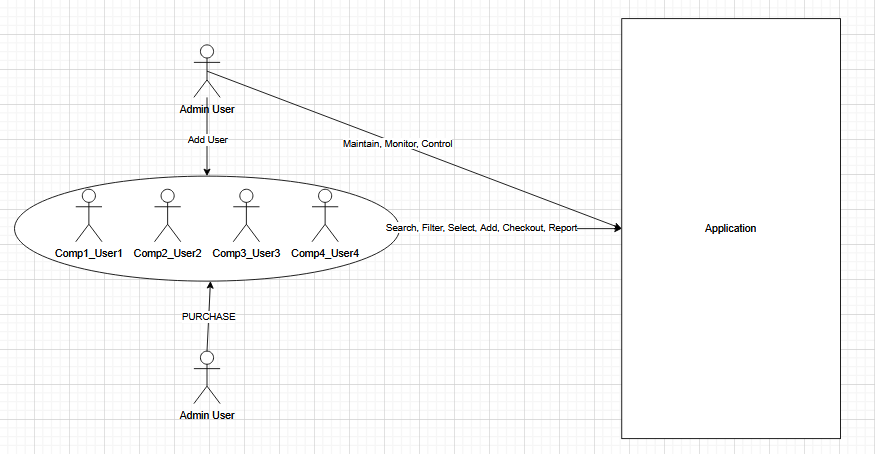

1. Zsolti
### A rendszer célja

A rendszer célja, hogy az értékesítők számára egy modern, 
könnyen kezelhető és átlátható webes felületet biztosítson a termékek kezeléséhez és értékesítéséhez.
A felületnek lehetőséget nyújt a készletek nyomon követésére, a termékek keresésére és szűrésére, valamint a számlák kezelésére.
Fontos szempont, hogy az alaklamazás felhasználóbarát legyen, 
így a különböző technikai tudással rendelkező felhasználók is könnyen eligazodhatnak rajta.

A partnercégek számára biztosított felületen az értékesítők gyorsan elérhetik a hozzájuk tartozó üzletek készleteit,
és szükség esetén bővíthetik azokat egy virtuális raktárból.
Riportkészítési funkciót biztosít, amely lehetővé teszi a napi, heti és havi (utóbbi kettő autómatikusan, megadott rendszeresség alapján) 
értékesítési adatok megjelenítését Excel formátumban, így segítve az értékesítő munkáját, és a vállalat üzleti folyamatainak módosítását.

A több termék iránt érdeklődő vásárlók kielégítésének kulcsa a korsár funkció.
Az értékesítő munkatárs így egyszerre több termék árusítását tudja elvégezni.

A rendszer elsődleges célja, hogy csökkentse az értékesítési folyamatok időigényét,
egyszerűsítse a munkatársak mindennapi tevékenységeit,
valamint pontos és naprakész információkat biztosítson a készletekről és az értékesítésekről.

*A rendszer működésének folyamatábrája*

2. Zsolti
### Projektterv

**Csapattagok és közös felelősség körök**

A négy fejlesztő egységes csapatként dolgozik, így mindenki részt vesz a backend, 
frontend, tesztelés és dokumentáció feladataiban is.

A munka megosztás dinamikusan, az aktuális projektigények szerint történik.

**Fő feladatkörök:**

- **Backend fejlesztés:** adatbázis, API-k, üzleti logika megvalósítása.
- **Frontend fejlesztés:** reszponzív Angular alapú felhasználói felület kialakítása.
- **Tesztelés:** egység- és funkcionális tesztek készítése, hibajavítás.
- **Dokumentáció:** követelmény- és rendszerterv, tesztterv, végső projektleírás elkészítése.

| Funkció / Story            | Feladat / Task                            | Prioritás | Becslés | Aktuális becslés | Eltelt idő | Hátralévő idő |
|----------------------------|-------------------------------------------|-----------|---------|------------------|------------|---------------|
| Követelményspecifikáció    | Dokumentum elkészítése                    | 0         | 10      | 10               | 10         | 0             |
| Funkcionális specifikáció  | Funkciók és folyamatok leírása            | 0         | 10      | 10               | 10         | 0             |
| Rendszerterv               | Architektúra és adatmodell kidolgozása    | 0         | 14      | 14               | 8          | 6             |
| Adatmodell                 | Adatbázis struktúra megtervezése          | 1         | 6       | 6                | 4          | 2             |
| Backend alapfunkciók       | API fejlesztés és üzleti logika           | 2         | 12      | 12               | 2          | 10            |
| Frontend alapok            | HTML/CSS, UI tervezés                     | 2         | 10      | 10               | 3          | 7             |
| Login funkció              | Bejelentkezés és jogosultságkezelés       | 2         | 8       | 8                | 0          | 8             |
| Termékkezelés              | Termékek megjelenítése, keresés, szűrés   | 2         | 10      | 10               | 0          | 10            |
| Kosár funkció              | Kosár logika és UI implementálása         | 2         | 10      | 10               | 0          | 10            |
| Riport funkció             | Napi/heti/havi riport készítése           | 1         | 8       | 8                | 0          | 8             |
| Tesztelés                  | Unit és funkcionális tesztek végrehajtása | 1         | 10      | 10               | 0          | 10            |
*Az Becslés/Aktuális becslés/Eltelt idő/Hátralévő idő oszlopok órában értendőek*

3. Zoli

4. Geri

5. Geri

6. Zsolti

7. Geri

8. Marci

9. Zoli

10. Zoli

11. Zsolti
### Tesztterv

A tesztelés célja, hogy a rendszer és a komponensi megfelelően működjenek, hibamenetesen szolgálják ki a felhasználók igényit, 
és megfeleljenek a funkcionális és követelmény specifikációban leírtaknak. A tesztelés során vizsgáljuk a rendszer stabilitását, 
teljesítményét, valamint a különböző böngészőkben való kompatibilitását.
A tesztelés célja továbbá a hibák feltárása és mielőbbi kijavítása, hogy az éles indulás és üzemeltetés zökkenőmentes legyen.

1. Egységtesztelés

A fejlesztés során minden implementált metódushoz "Unit" tesztet, azaz egységtesztet kell írni. 
Célja, hogy ellenőrízzük az egyes modulok és funkciók helyes működését már a fejlesztési fázisban.
- A kódlefedettség tekintetében célunk a magas arány elérése, azonban ez nem mehet a tesztek minőségének rovására.
  - 80%-90% százalékos lefedettség általában elégséges.
- A metódusok akkor tekinthetők késznek, ha a hozzájuk tartozó tesztesetek hibamentesen futnak le.
- A tesztelendő fő modulok:
  - Bejelentkezési és jogosultségkezelési logika.
  - Készletkezeléshez (termék hozzáadása, törlése, módosítása) tartozó CRUD műveletek.
  - Kosár funkció (termék hozzáadás és eltávolítása).
  - Riport generálás.

2. Alfa teszt

Az alfa tesztelés célja a rendszer funkcióinak ellenőrzése a fejlesztők és tesztelők által, belső tesztkörnyezetben.
A tesztkörnyezet ezáltal kontrollálható és konfigurálható így ideális teret ad az éles működés rekreálására.
- Vizsgáladó:
  - Böngészők közötti kompatibilitás.
  - Alapfunkciók stabilitása.

3. Béta teszt

A béta tesztelés során a tesztkörnyezet kevésbé korlátozott, azáltal, hogy ez nem tesztelők végzik.
Így jobban replikálható az éles átadás.
Az esetlegesen fellépő problémákról a tesztelésre jogosult felhasználók értesítik a fejleszők és rendszerüzemeltetők csapatát, 
amely csapat az elvárt működést próbálják elérni.

### Tesztelendő funkciók

- Backend funkciók:
  - Adatbázis kezelés:
    - adatok rögzítése, módosítása és törlése hibamentesen működjön.
  - Riport generálás:
    - napi, heti és havi riportok pontos adatokat mutassanak.
  - Raktár funkció:
    - készletnövelés működjön minden partnercég esetén.
- Frontend funkciók:
  - Bejelentkezési folyamat:
    - Helyes adatok esetén sikeres bejelentkezés.
    - Hibás adatok esetén hibaüzenet jelenjen meg.
  - Felhasználói élmény: minden böngészőben reszponzívan jelenjen meg.
  - Keresés és szűrés:
    - Termékek keresése cikkszám alapján.
    - Szűrés kategória, ár és márka alapján.
    - Eredmények frissítése valós időben.
  - Kosár funkció:
    - Termékek hozzáadása és eltávolítása.
    - Kosár végösszegének automatikus frissítése.
    - Kosár tartalmának mentése kijelentkezés után.
  - Riportok:
    - Napi riport manuális készítése.
    - Heti és havi riportok automatikus generálása.

12. Marci

13. Marci